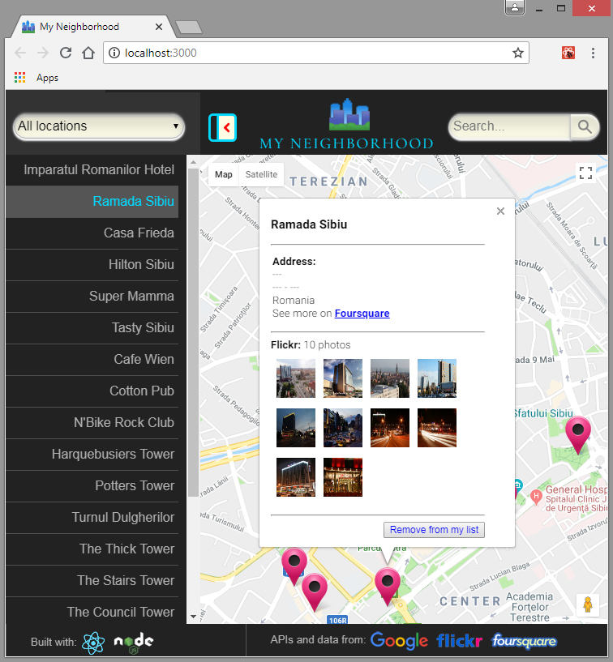
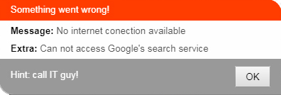
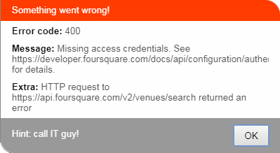
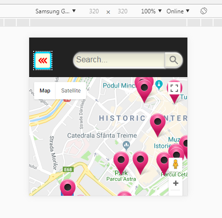

# My Neighborhood

## Description

This is a single page application featuring a map of a neighborhood somewhere on Earth. The functionality provide highlighted locations, third-party data about those locations and various ways to browse the content.


## Functionality




(features)

When the page is loaded, it display by default map **markers** identifying a set of **locations**. Also, all of these locations names are displayed in a list view, on the window left side.
This list provide a **filter** option to filter both the list view and the map markers displayed by default on load. The list view and the markers are updating accordingly in real time. This filter is an option list where options are the 'types' of the Google places (e.g. 'point of interest', 'restaurant', 'administrative').
When a map marker or list view entry is clicked, **3rd part API's** are used to provide additional informations on an google map **infoWindow**. From Foursquare, informations about the location address are requested. Flickr API is used to retrieve a list of available photos inside or near the location. 
Also, the user is able to **search** for new locations using Google's Places API Web Service. Search results are displayed in the map with a different marker icon. Clicking on a marker, the user is allowed to add (if does not exist) or remove (if exist) that location to/from the default list.



(error handled)

All data APIs used in the project loads asynchronously and errors are handled. A message is displayed notifying the user about the error. Any error does not brings negative impact to the UI.



(responsive design)

The app render on-screen in a responsive manner and is usable across modern desktop, tablet and phone browsers.


## Installation

In order to run the application, node modules should be installed in the app directory.
Run ```npm install``` from command-line in the app directory and then ```npm start``` which will start the app in the default browser at: localhost:3000.

## Credits

To build this app, the following libraries, platforms and API's are used:

- [React](https://reactjs.org/)
- [Node.js](https://nodejs.org/en/)
- [Google API](https://developers.google.com/apis-explorer/)
- [Flickr API](https://www.flickr.com/services/api/)
- [Foursquare API](https://developer.foursquare.com/)


## License
The content of this repository is licensed under a [Creative Commons Attribution License](https://creativecommons.org/licenses/by/3.0/us/)
